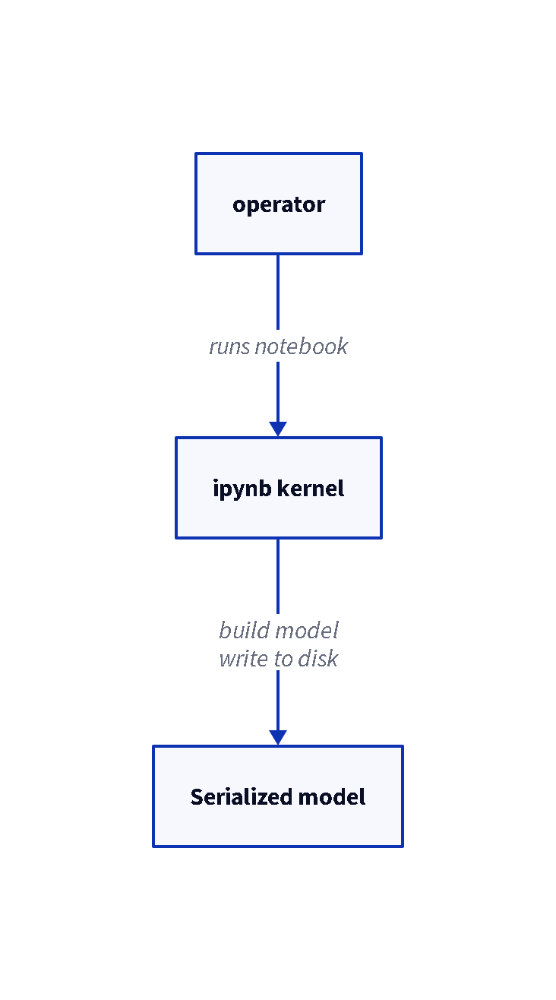

# Intelligent Tutor

## Table of Contents
- [Intelligent Tutor](#intelligent-tutor)
  - [Table of Contents](#table-of-contents)
  - [Project Organization](#project-organization)
  - [Model](#model)
    - [Output Fuzzy Set](#output-fuzzy-set)
    - [Input Fuzzy Sets](#input-fuzzy-sets)
    - [Precise Inputs](#precise-inputs)
  - [Events](#events)
      - [LessonStarted](#lessonstarted)
      - [LessonStopped](#lessonstopped)
      - [AnswerSubmitted](#answersubmitted)
      - [LessonTooDifficultFeedbackSubmitted](#lessontoodifficultfeedbacksubmitted)
    - [Projections](#projections)
      - [Experience](#experience)
      - [Average Duration](#average-duration)
      - [Accuracy](#accuracy)
      - [Repetition](#repetition)
  - [Development Setup](#development-setup)
  - [Build the model](#build-the-model)
  - [Run Tests](#run-tests)
  - [Web Server](#web-server)
    - [Start webserver](#start-webserver)
    - [Loading model from disk](#loading-model-from-disk)
    - [Open API Specification](#open-api-specification)
      - [Build Time](#build-time)
      - [Runtime](#runtime)
  - [References](#references)

## Project Organization
```
intelligent_tutor/
├── data/
│   └── model.pkl            # Pickle file for the serialized model
├── diagrams/                # D2 diagrams
├── docs/                    # Documentation
├── notebooks/               # Jupyter notebooks for building and training models
├── scripts/
    ├── generate_d2_diagrams # Generate PNGs of diagrams
    ├── generate_openapi.py  # Script to fetch OpenAPI schema
│   └── start_web_server.sh  # start the web server
├── .venv/                   # Virtual environment directory
├── dev-requirements         # Dependencies only required for development
├── main.py                  # Main FastAPI application
├── pyproject.toml           # Build system requirements for python project
├── README.md                # Project documentation
└── requirements.txt         # Dependencies required for production
```

## Model

Fuzzy Expert System to predict lesson difficulty appropriate for a specific user.

### Output Fuzzy Set
`Lesson Difficulty` - easy, moderate, hard, impossible

### Input Fuzzy Sets
* `Experience` - beginner, intermediate, expert
* `Response time` - slow, medium, fast, immediate
* `Accuracy` - bad, cointoss, good, perfect
* `Repetition` - rote, understand, apply, correlate

### Precise Inputs
* Experience - number of lessons
* Response time - average duration of lessons
* Accuracy - correct answers versus total lessons
* Repetition - count of explicit “too hard” feedback

## Events

#### LessonStarted
```json
{
  "event": "LessonStarted",
  "timestamp": "2025-03-26T12:00:00Z",
  "lesson_id": "abc123",
  "student_id": "user456",
  "difficulty": "medium"
}
```

#### LessonStopped
```json
{
  "event": "LessonStopped",
  "timestamp": "2025-03-26T12:30:00Z",
  "lesson_id": "abc123",
  "student_id": "user456",
  "duration_seconds": 1800
}
```

#### AnswerSubmitted
```json
{
  "event": "AnswerSubmitted",
  "timestamp": "2025-03-26T12:15:00Z",
  "lesson_id": "abc123",
  "student_id": "user456",
  "question_id": "q789",
  "answer": "B",
  "correct": true
}
```

#### LessonTooDifficultFeedbackSubmitted
```json
{
  "event": "LessonFeedbackSubmitted",
  "timestamp": "2025-03-26T12:35:00Z",
  "lesson_id": "abc123",
  "student_id": "user456"
}
```

### Projections

Fuzzy input sets need to be derived from precise inputs. The precise inputs themselves can be derived from applying aggregations of the events. A **sliding window** can be used to bound the events considered by a time frame.

> Example:
> 
> To determine if a user's response time is slow, medium, fast, immediate
>
> you must first have a precise calculation of the average duration of their lessons
>
> average duration of lessons can be computed by considering the average difference between matching lessonStart and lessonStop events withing a certain time fame, the sliding window.

#### Experience
Number of lessons completed in a time frame

#### Average Duration

Average amount of time spent on lessons

* Option 1: Derive from event stream
    1. Retrieve all LessonStarted and LessonStopped events where user is X and timestamp in sliding window
    1. Pair each LessonStarted event with its corresponding LessonStopped event using the lesson_id
    2. Compute duration
       1. duration=timestamp of LessonStopped−timestamp of LessonStarted
    3. Compute average duration
 1. Option 2: LessonStop includes the duration
    1. Retrieve all LessonStopped events where user is X and timestamp in sliding window
    2. Read the duration
    3. Compute the average duration

#### Accuracy
Number of correct answers versus total number of lessons within time frame
Repetition - count of explicit “too hard” feedback

#### Repetition
Number of times explict feedback was provided that a lesson was too difficult

## Development Setup
```
python -m venv .venv

./.venv/Scripts/activate

pip install -r requirements.txt
```

## Build the model
Open `./notebooks/lesson_prediction.ipynb` and use python from the virtual environment as the kernel. Run the notebook and it will serialize and write the model to disk as a pickle file.



## Run Tests
Run the following from a shell
```
pytest
```

If there are errors consider setting the PYTHONPATH to the root of the project

```ps
$env:PYTHONPATH="c:\dev\intelligent_tutor"; pytest
```

```sh
export PYTHONPATH=c:/dev/intelligent_tutor; pytest
```

## Web Server

FastAPI Web server to enable client application to communicate over HTTP to request for predictions from the model.

### Start webserver
```
uvicorn main:web_server --host 127.0.0.1 --port 8000
```

### Loading model from disk
The web server will load the serialized model from disk so that it can be used to make predictions.


### Open API Specification

#### Build Time
The Open API spec can be generated at build time by executing the following steps:
1. Run the web server
2. In a separate shell, run the following:
    ```py
    python ./scripts/generate_openapi.py
    ```

#### Runtime
The Open API spec can be fetched from the the server at runtime via the `/openapi.json` route.
``` 
curl http://localhost:8000/openapi.json
```

## References
- https://www.sciencedirect.com/science/article/pii/S2666920X20300035